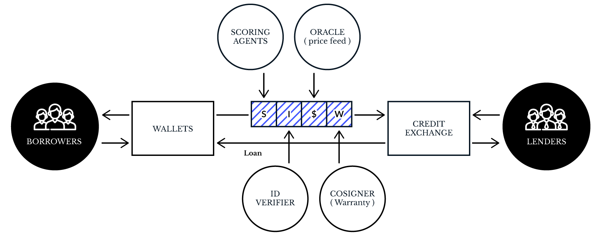

# RCN

RCN is a protocol based on smart contracts that standardizes credit lending through blockchain technology. The network can connect borrowers, lenders, and other network agents all over the world, allowing each one of them to manage the credit in their local currencies.

More information on the  [Whitepaper](./WHITEPAPER.md) page.

# **V2 Basalt** - 233

The Basalt is the last stable version of the RCN protocol it's currently working on the Ethereum mainnet; allows borrowers, lenders, and cosigners to request, lend and pay bullet loans. These loans are configured with an interest rate, a punitive interest rate, a duration, and a first payment date; all the accrued interests are calculated on-chain.



### Deployed contracts

RCN Token: [0xf970b8e36e23f7fc3fd752eea86f8be8d83375a6](https://etherscan.io/token/0xf970b8e36e23f7fc3fd752eea86f8be8d83375a6)

NanoLoanEngine: [0xba5a17f8ad40dc2c955d95c0547f3e6318bd72e7](https://etherscan.io/address/0xba5a17f8ad40dc2c955d95c0547f3e6318bd72e7)

The activity of the network can be monitored on the [dApp](https://github.com/ripio/rcn.loans) https://rcn.loans/

----

# Quick start

## Setup Web3

Web3 is a library used to interact with an Ethereum node, in this case, we will use it to interact with the RCN contracts on the Ethereum mainnet.

For this example we will be using the Javascript implementation of the library, to install: [web3js](https://github.com/ethereum/web3.js/)
```javascript
npm install web3
```

### Setup engine connector

```javascript
const web3 = new Web3(new HttpProvider("https://main.node.rcn.loans:8545/"));
const engine_address = "0xba5a17f8ad40dc2c955d95c0547f3e6318bd72e7";
const engine = web3.eth.contract(engineAbi).at(engine_address);
```

With the *engine* object we are going to interact with the NanoLoanEngine contract, the *engineAbi* specifies all the contract methods and their signatures, a copy can be found here [NanoLoanEngine.json](./contracts/compiled/NanoLoanEngine.json)

**Notice:** This setup will be able to read information of the RCN network, to write new transactions additional steps must be taken (Create address and fund with ETH).

<!-- TODO: Add link to configure account on web3 -->

## Request a loan

On the Basalt engine loans are requested strictly on-chain and initiated by the borrower or a third address called the *creator*, the creator gives context on the loan creation, usually is provided by borrower's wallet.


Calling **createLoan** on the NanoLoanEngine creates a new loan request; this loan request is only valid right away if the caller of the method is the borrower.

```solidity
function createLoan(
    address _oracle,
    address _borrower,
    bytes32 _currency,
    uint256 _amount,
    uint256 _interestRate,
    uint256 _penaltyInterestRate,
    uint256 _duesIn,
    uint256 _firstPayment,
    uint256 _expiration,
    string _metadata
) public returns (uint256 id) {
```

#### Example

Loan configuration

| Field                 	| Value                   	| Encoded                                             	| Notes                                                                                                                                                     	|
|-----------------------	|-------------------------	|-----------------------------------------------------	|-----------------------------------------------------------------------------------------------------------------------------------------------------------	|
| Oracle                	| Ripio ARS Oracle        	| address: 0x33332025ad35a821eec5f1e10459222c8e4c62c3 	| The contract should implement the getRate method                                                                                                          	|
| Currency              	| ARS                     	| bytes32: 0x41525300 ... 000                         	| The encoded value is the hex of the UTF-8 encoded string, with leading 0                                                                                  	|
| Borrower              	| Address of the borrower 	| address: 0x7d7cfefb91c8bb2c330ec66d99c225d47c9131c0 	| The borrower can be any EOA or Contract, if the caller of the method is not the borrower, the loan is not approved until the approveLoan method is called 	|
| Amount                	| 2000.00                 	| 200000                                              	| The amount should be expressed on its minimum unit, this unit is specified by the Oracle                                                                  	|
| Interest rate         	| 20 %                    	| 15552000000000                                      	| The interest rate is encoded as the divisor of 10.000.000 and it's expresed by second                                                                     	|
| Penalty interest rate 	| 47.3 %                  	| 6575898520084                                       	| The interest rate is encoded as the divisor of 10.000.000 and it's expresed by second                                                                     	|
| Dues in               	| 60 days                 	| 5184000                                             	| Time after the lent when the debt is going to be considered overdue, seconds                                                                              	|
| First payment         	| 40 days                 	| 3456000                                             	| Time after the lent when payment will start to discount interest, on seconds                                                                              	|
| Expiration            	| 01/01/2060 12:00am      	| 2840140800                                          	| Timestamp of the expiration of this request                                                                                                               	|
| Metadata              	| Hello EVM!              	| Hello EVM!                                          	| Metadata with information for the dApp, no specific format required                                                                                       	|

Javascript create request:

```javascript
const r_create = await engine.createLoan(
                    "0x33332025ad35a821eec5f1e10459222c8e4c62c3",                         // Oracle
                    "0x7d7cfefb91c8bb2c330ec66d99c225d47c9131c0",                         // Borrower
                    "0x4152530000000000000000000000000000000000000000000000000000000000", // Currency
                    200000,                                                               // Amount
                    15552000000000,                                                       // Interest rate
                    6575898520084,                                                        // Punitive interest rate
                    5184000,                                                              // Duration
                    3456000,                                                              // First payment
                    2840140800,                                                           // Expiration
                    "Hello EVM!",                                                         // Metadata
                    { 
                        from: "0x263231ed9b51084816a44e18d16c0f6d0727491f"                // Creator
                    }
                );

const loan_id = ...; // TODO: Read loan id
```

## Approve a request

Requests are by-default non-ready to be lent (unless the creator is the borrower itself). To change the status of a loan to approved the approveLoan **or** approveLoanIdentifier methods must be called.

#### Direct approval

The **approveLoan** method approves the request if the caller is the Borrower, any other address could call this method, but it will not affect the request.

```javascript
const r_approve = await engine.approveLoan(loan_id);
```

#### Settle offline approval

The **approveLoanIdentifier** method approves the request using a message signed by the borrower; this allows the borrower to request a loan without needing to have ETH in advance.

```javascript
// Calculate the request identifier/hash using the method provided by the contract
const loan_identifier = await engine.buildIdentifier(
                            "0x33332025ad35a821eec5f1e10459222c8e4c62c3",                         // Oracle
                            "0x7d7cfefb91c8bb2c330ec66d99c225d47c9131c0",                         // Borrower
                            "0x263231ed9b51084816a44e18d16c0f6d0727491f",                         // Creator
                            "0x4152530000000000000000000000000000000000000000000000000000000000", // Currency
                            200000,                                                               // Amount
                            15552000000000,                                                       // Interest rate
                            6575898520084,                                                        // Punitive interest rate
                            5184000,                                                              // Duration
                            3456000,                                                              // First payment
                            2840140800,                                                           // Expiration
                            "Hello EVM!"                                                          // Metadata
                        );

// Sign the hash with the borrower address
const signature = await web3.eth.sign("0x7d7cfefb91c8bb2c330ec66d99c225d47c9131c0", loan_identifier).slice(2)

// Split the signature
let r = `0x${signature.slice(0, 64)}`
let s = `0x${signature.slice(64, 128)}`
let v = web3.toDecimal(signature.slice(128, 130)) + 27

// Register the approve
await engine.registerApprove(loan_identifier, v, r, s)
```
**Notice:** Contracts can't sign messages, this method only works if the Borrower is an EOA

Once the request is approved it's ready to be filled! The loan request now should be visible on https://rcn.loans/

## Lend a loan

Any EOA or Contract can fill a request; the only requisite is to have RCN to transfer the money and ETH to pay the gas. The application must be non-expired, approved and non-filled or destroyed to be able to be lent.

The lender should transfer the RCN amount equivalent to the requested amount/currency; the conversion rate can be retrieved using the **getRate** method of the Oracle. If there is no Oracle, the lender should send the amount directly on RCN.

For perming this operation the **oracleData** will be required, this can be retrieved from the URL provided on the Oracle, if not available it will be assumed that the oracle data is not needed.

```javascript
// Load the oracle contract
const oracle_address = await engine.getOracle(loan_id);
const oracle = web3.eth.contract(oracleAbi).at(oracle_address);

// Load oracle data
const oracle_url = await oracle.url();
const response = await (await fetch("https://oracle.ripio.com/rate/")).json();
const oracle_data = response.find(i => i.currency == "0x4554480000000000000000000000000000000000000000000000000000000000")["data"];

// Get rate estimation
const rate_response = await oracle.getRate("0x4554480000000000000000000000000000000000000000000000000000000000", oracle_data);
const rate = rate_response[0];
const decimals = rate_response[1];

// Get amount to lend
const amount_currency = await engine.getAmount(loan_id);
const amount_tokens =  amount_currency * rate * 10 ** (18 - decimals) / 10 ** 18;

// Approve the RCN tokens debit
const rcn_address = "0xf970b8e36e23f7fc3fd752eea86f8be8d83375a6";
const rcn_token = web3.eth.contract(tokenAbi).at(rcn_address);
await rcn_token.approve(engine_address, amount_tokens);

// Lend!
await engine.lend(
    loan_id,     // Loan id
    oracle_data, // Oracle data
    0x0,         // Cosigner address
    [],          // Cosigner data
    {
        from: "0x09274ac7c07687ceb108a392b26affc3e5723670" // Lender address
    }
);
```

**Notice**: This loan has no Cosigner, in case of having a Cosigner the address should be provided along with the Cosigner data.

## Reading the status

The loan has internal variables to keep track of the debt lifecycle; these variables don't change between calls, and the current status is calculated upon any observation or interaction.

The most important read methods are:

| Field                 	| Getter                                      	| Note                                                                          	|
|-----------------------	|---------------------------------------------	|-------------------------------------------------------------------------------	|
| Amount                	| getAmount(loan_id) -> Integer               	| Amount requested                                                              	|
| Approved by borrower  	| getApproved(loan_id) -> Bool                	| True if approved by borrower                                                  	|
| Borrower              	| getBorrower(loan_id) -> Address             	| Set on the request                                                            	|
| Cosigner              	| getCosigner(loan_id) -> Address             	| If used on lend()                                                             	|
| Creator               	| getCreator(loan_id) -> Address              	| Who created the request                                                       	|
| Currency              	| getCurrency(loan_id) -> Bytes32             	| Set on the request                                                            	|
| Duration              	| getDuesIn(loan_id) -> Integer               	| Set on the request                                                            	|
| Due time              	| getDueTime(loan_id) -> Integer              	| Equals duration + lent_timestamp                                              	|
| Expiration            	| getExpiration(loan_id) -> Integer           	| Timestamp expiration of the request                                           	|
| First payment         	| getCancelableAt(loan_id) -> Integer         	| Set on the request                                                            	|
| Interest rate         	| getInterestRate(loan_id) -> Integer         	| Set on the request                                                            	|
| Is approved           	| getApprobation(loan_id, address) -> Bool    	| True if the address approved the request                                      	|
| Lender balance        	| getLenderBalance(loan_id)                   	| Paid tokens pending to withdraw                                               	|
| Oracle                	| getOracle(loan_id) -> Address               	| Set on the request                                                            	|
| Paid                  	| getPaid(loan_id) -> Integer                 	| Total paid until now, on loan currency                                        	|
| Penalty interest rate 	| getInterestRatePunitory(loan_id) -> Integer 	| Set on the request                                                            	|
| Pending payment       	| getPendingAmount(loan_id) -> Integer        	| This view modifies the state, use with care when called from another contract 	|
| Status                	| getStatus(loan_id) -> Integer               	| 0 = Request; 1 = Ongoing; 2 = Paid; 3 = Destroyed                             	|


Getters can be called quickly using Web3:
```javascript
// Due time of the loan
await engine.getDueTime(loan_id);
```

## Paying a loan

Loans can be paid, fully or partially at any moment, similarly to the lender; the payer has to send the equivalent RCN to the amount desired to pay. The payer can be any address.

Not all loans will discount interest on early payments, that depends on the configuration of the debt.

**Notice:** Some loans increment their accrued interest second by second, so to fully pay a debt an amount larger than the current remaining should be paid. The exceeding amount will never be pulled from the payer

```javascript
// User input (full payment)
const pay_amount = 2200;

// Load the updated oracle data
const response = await (await fetch("https://oracle.ripio.com/rate/")).json();
const oracle_data = response.find(i => i.currency == "0x4554480000000000000000000000000000000000000000000000000000000000")["data"];

// Get rate estimation
const rate_response = await oracle.getRate("0x4554480000000000000000000000000000000000000000000000000000000000", oracle_data);
const rate = rate_response[0];
const decimals = rate_response[1];

// Get amount to lend
const amount_tokens =  pay_amount * rate * 10 ** (18 - decimals) / 10 ** 18;

// Approve the RCN tokens debit
await rcn_token.approve(engine_address, amount_tokens);

// Pay!
await engine.pay(
    loan_id,                                               // Loan id
    pay_amount,                                            // Amount to pay in the loan currency
    "0x09274ac7c07687ceb108a392b26affc3e5723670",          // Symbolic payer
    oracle_data,                                           // Oracle data
    {
        from: "0x09274ac7c07687ceb108a392b26affc3e5723670" // Sender of the payment
    }
);
```

## Withdraw payments

The tokens used to pay the loan don't go directly to the Lender address, they stay on the NanoLoanEngine until the withdrawal method is called.

This behavior is designed to allow lenders to keep track of the payments, as pushing tokens to a smart contract can't be detected from itself.

**Notice:** The funds will remain tied to the Loan and no to the lender account, if the loan is transferred the funds not withdrawn will also be transferred.

```javascript
// Read funds on the loan
const funds = await engine.getLenderBalance(loan_id);

// Withdraw!
await engine.withdrawal(
    loan_id,                                               // Loan id
    "0x09274ac7c07687ceb108a392b26affc3e5723670",          // Destination of the funds
    funds,                                                 // Amount to withdraw
    {
        from: "0x09274ac7c07687ceb108a392b26affc3e5723670" // Address of the current owner
    }
);
```

---

# Core components

The RCN protocol has two special agents who provide services to borrowers/lenders. This services are optional and aren't part of the core system; nonetheless, any new implementation will be compatible with the existing protocol without needing to be approved.

## Oracle

An oracle provides the ability to use any currency on the RCN Engine; the Oracle should give the conversion rate between RCN Token and the supported currencies.

The most important method on the interface is:

```solidity
contract OracleInterface {
    function url() external view returns (string);

    function getRate(
        bytes32 currency,
        bytes data
    ) external returns (uint256 rate, uint256 decimals);
}
```

The **getRate** should return the conversion rate between RCN and the bytes32 currency; this conversion rate is delivered as a pair of **rate** and **decimals**, the formula used to apply the rate is:

```
rate / 10 ** (18 - decimals) = 1 RCN [10 ** 18 Wei]
Ej: decimals = 2; rate = 966180569582171264
966180569582171264 / 10 ** (18 - 2) [ARS] = ~96,61 [RCN]
```

The rate can never be 0 and decimals has to be between 0 and 18 (inclusive). This method is **not a view** and it's allowed to modify the state.

**Notice:** The rate has to be delivered on the minimum possible unit of the bytes32 currency, Ej: cents for ARS.

#### Data

The data parameter can be used to get any required information to calculate the rate, (Ej: the rate can be retrieved from a signed message). The data should be available on the URL provided by the **URL()** method, this endpoint should return a JSON array with all the currencies available on the Oracle and their corresponding data, Ej:

```json
[
  {
    "currency": "0x4554480000000000000000000000000000000000000000000000000000000000", 
    "data": "0x000000000000000000000000000000000000000000000000000000005bae7b950000000000000000000000000000000000000000000001ed3ec265a0ba8000000000000000000000000000000000000000000000000000000000000000000012000000000000000000000000000000000000000000000000000000000000001bbf6285cc2b6cda53b292f604672d74828d226fa46a30fb775776756b06003cba6dfb84dc2921b76cf9d9ee88f57a056119a59583da9ffad0877560ac16cc6c1c", 
    "decimals": 18, 
    "rate": 9098767117055640469504, 
    "timestamp": 1538161557, 
  }, 
  {
    "currency": "0x4254430000000000000000000000000000000000000000000000000000000000", 
    "data": "0x000000000000000000000000000000000000000000000000000000005bae7b950000000000000000000000000000000000000000000038f9800e8f10860000000000000000000000000000000000000000000000000000000000000000000008000000000000000000000000000000000000000000000000000000000000001b9be101f867a5aa9f2281e7c36b844222bfa87fd40ec64edd2a64aaf2faaf140e1222991eda27e1e8f20c7a8e0eb39b5a4702da47ad5b5cb9a1b6c6738290ea06", 
    "decimals": 8, 
    "rate": 269054989785041469440000, 
    "timestamp": 1538161557, 
  }, 
  {
    "currency": "0x4152530000000000000000000000000000000000000000000000000000000000", 
    "data": "0x000000000000000000000000000000000000000000000000000000005bae7b950000000000000000000000000000000000000000000000000d6ea37b23a71a800000000000000000000000000000000000000000000000000000000000000002000000000000000000000000000000000000000000000000000000000000001bb408203f95d536453bd25e8f36b724969b22053d30ee1386da16393387e45ed152b6ec14dd097d5c584972fe634ebc7dde4d2030fb0c8bc637cb15e5f25b491c", 
    "decimals": 2, 
    "rate": 967890719205694080, 
    "timestamp": 1538161557, 
  }
]
```

**Notice:** If the URL is not provided or the JSON doesn't contain the required currency, an empty data will be presumed.

#### Examples

**Mana** oracle: [0x2aaf69a2df2828b55fa4a5e30ee8c3c7cd9e5d5b](https://etherscan.io/address/0x2aaf69a2df2828b55fa4a5e30ee8c3c7cd9e5d5b)

**ARS** / **ETH** / **BTC** Oracle by Ripio:  [0x33332025ad35a821eec5f1e10459222c8e4c62c3](https://etherscan.io/address/0x33332025ad35a821eec5f1e10459222c8e4c62c3)

## Cosigner

Cosigners give insurance to Lenders on the RCN Network; for a cosigner to work is mandatory to be implemented as a contract.

Cosigners can charge a fee to provide protection, the terms of the coverage are an agreement between the Lender and the Cosigner, the RCN protocol does not require a specific type of insurance.

#### Handshake

If the lender chooses to use the Cosigner, the NanoLoanEngine will call the **requestCosign()** method; the contract should evaluate if is going to accept the application and in case of taking it, it should call **cosign()** on the Engine contract, on this method the cosigner should pass how many tokens is requesting as payment.

The engine will also check if the **requestCosign()** call returns true.

```solidity
interface CosignerInterface {
    function url() external view returns (string);

    function requestCosign(
        address engine,
        uint256 index,
        bytes cosignerData,
        bytes oracleData
    ) external returns (bool);

    function claim(
        address engine,
        uint256 index,
        bytes oracleData
    ) external returns (bool);
}
```

**Notice:** The **requestCosign()** method is called after sending the funds to the borrower, and the cosigner could make use of the received tokens.

#### Data

The **cosignerData** and **URL()** are handled similarly as the Oracle; the cosigner can use this tools to create offers without making any transactions.

#### Examples

Mortgages cosigner: [0x74ce62f642d491f87c2c6119dd6cc12a05434c87](https://etherscan.io/address/0x74ce62f642d491f87c2c6119dd6cc12a05434c87)

Example implementation: [ReferenceCosigner.sol](./contracts/examples/ReferenceCosigner.sol)
